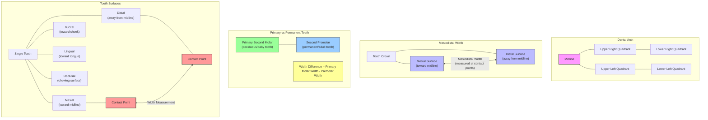
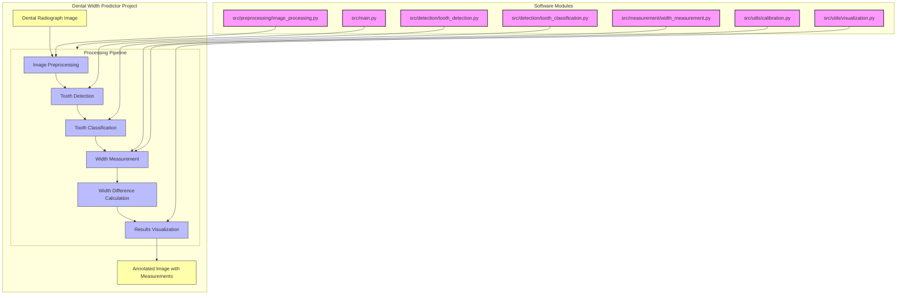

# Dental Width Predictor

A tool for measuring and predicting tooth width differences between primary second molars and second premolars in dental radiographs.

## Overview

This project automates the process of measuring the width difference between primary second molars and underlying second premolars in dental panoramic radiographs. This measurement is valuable for orthodontic treatment planning and prediction of tooth development.

## Dental Terminology

Understanding dental terminology is important for using this tool:



## Features

- Image preprocessing for dental radiographs
- Automatic detection of primary second molars and underlying second premolars
- Measurement of tooth width at the widest point (contact points)
- Calculation of width differences
- Visualization of measurements

## System Architecture



## Installation

```bash
# Clone the repository
git clone https://github.com/ajeetraina/dental-width-predictor.git
cd dental-width-predictor

# Create a virtual environment (optional but recommended)
python -m venv venv
source venv/bin/activate  # On Windows, use: venv\Scripts\activate

# Install dependencies
pip install -r requirements.txt
```

## Usage

```bash
python src/main.py --image path/to/radiograph.jpg
```

Or use the provided Jupyter notebooks in the `notebooks` directory for interactive analysis.

## Project Structure

```
dental-width-predictor/
├── data/               # Sample radiograph images and datasets
├── models/             # Pre-trained models for tooth detection
├── notebooks/          # Jupyter notebooks for visualization and testing
├── src/                # Source code
│   ├── preprocessing/  # Image preprocessing modules
│   ├── detection/      # Tooth detection algorithms
│   ├── measurement/    # Width measurement tools
│   ├── utils/          # Utility functions
│   └── main.py         # Main entry point
├── tests/              # Unit tests
└── requirements.txt    # Dependencies
```

## How It Works

1. **Preprocessing**: Enhance the dental radiograph for better feature detection
2. **Tooth Detection**: Identify and segment individual teeth in the image
3. **Tooth Classification**: Classify and locate primary second molars and second premolars
4. **Width Measurement**: Measure the width at the widest points (contact points)
5. **Difference Calculation**: Calculate the width difference between corresponding teeth
6. **Visualization**: Display results with overlays showing measurements

## License

MIT

## Contributing

Contributions are welcome! Please feel free to submit a Pull Request.
