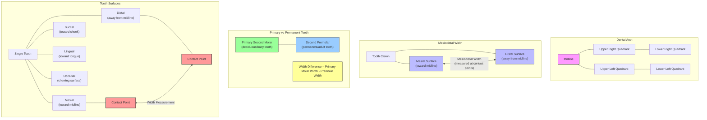
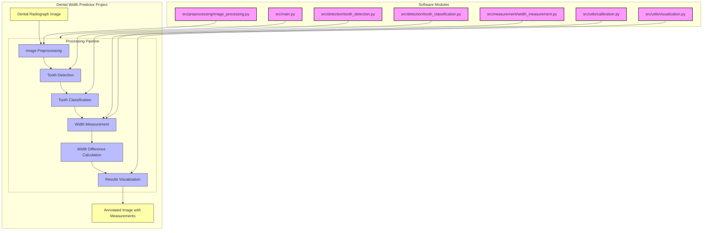

# Dental Width Predictor

A tool for measuring and predicting tooth width differences between primary second molars and second premolars in dental radiographs.

## Overview

This project automates the process of measuring the width difference between primary second molars and underlying second premolars in dental panoramic radiographs. This measurement is valuable for orthodontic treatment planning and prediction of tooth development.

## Dental Terminology

Understanding dental terminology is important for using this tool:



## Features

- Image preprocessing for dental radiographs
- Automatic detection of primary second molars and underlying second premolars
- Measurement of tooth width at the widest point (contact points)
- Calculation of width differences
- Visualization of measurements
- Batch processing for multiple images

## System Architecture



## Installation

```bash
# Clone the repository
git clone https://github.com/ajeetraina/dental-width-predictor.git
cd dental-width-predictor

# Create a virtual environment (optional but recommended)
python -m venv venv
source venv/bin/activate  # On Windows, use: venv\Scripts\activate

# Install dependencies
pip install -r requirements.txt
```

## Usage

### Processing a Single Image

```bash
python src/main.py --image path/to/radiograph.jpg --output results/output.jpg
```

### Processing Multiple Images (Batch Processing)

For datasets with multiple images (20-30 images):

```bash
# Place your images in the data directory
mkdir -p data/my_radiographs
# Copy your images to data/my_radiographs/

# Run batch processing
python src/batch_processing.py --input data/my_radiographs --output results
```

This will:
1. Process each image in the directory
2. Save visualizations showing measurements
3. Save detailed measurement data as JSON files
4. Generate a CSV summary of all measurements

### Analyzing Results

After batch processing, you'll find in the `results` directory:
- `*_visualization.jpg`: Visual representation of detected teeth and measurements
- `*_measurements.json`: Detailed measurement data in JSON format
- `measurements_summary.csv`: Combined data from all images for statistical analysis

## Dataset Management

### Using Sample Images

The repository includes a `data/samples` directory where you can find example radiographs:

```bash
# Process a sample image
python src/main.py --image data/samples/sample1.jpg
```

### Adding Your Own Dataset

You have several options for working with your dataset:

#### Option 1: Add Small Sample Images to Git

For a few representative images (recommended for public repositories):

```bash
# Copy a few small sample images (anonymized) to the samples directory
cp path/to/anonymized_sample1.jpg data/samples/

# Add to Git repository
git add data/samples/*.jpg
git commit -m "Add anonymized sample radiographs"
git push
```

#### Option 2: Use Git LFS for Larger Datasets

For larger image sets (20-30 images), consider using [Git Large File Storage (LFS)](https://git-lfs.github.com/):

```bash
# Install Git LFS
git lfs install

# Track image files with Git LFS
git lfs track "*.jpg" "*.png" "*.tiff"
git add .gitattributes

# Create dataset directory
mkdir -p data/full_dataset

# Add images to the dataset directory
cp path/to/images/*.jpg data/full_dataset/

# Commit and push
git add data/full_dataset
git commit -m "Add full radiograph dataset using Git LFS"
git push
```

#### Option 3: Local Dataset (Not in Git)

For private datasets or very large files:

```bash
# Create a directory for your dataset (not tracked by Git)
mkdir -p data/my_radiographs

# Copy your images to this directory
cp path/to/images/*.jpg data/my_radiographs/

# Ensure the directory is ignored in .gitignore (already configured)
```

## Project Structure

```
dental-width-predictor/
├── data/               # Sample radiograph images and datasets
│   ├── samples/        # Example radiographs included in the repository
│   └── my_radiographs/ # Your dataset (not tracked by Git)
├── models/             # Pre-trained models for tooth detection
├── notebooks/          # Jupyter notebooks for visualization and testing
├── src/                # Source code
│   ├── preprocessing/  # Image preprocessing modules
│   ├── detection/      # Tooth detection algorithms
│   ├── measurement/    # Width measurement tools
│   ├── utils/          # Utility functions
│   ├── batch_processing.py # Module for processing multiple images
│   └── main.py         # Main entry point
├── tests/              # Unit tests
└── requirements.txt    # Dependencies
```

## How It Works

1. **Preprocessing**: Enhance the dental radiograph for better feature detection
2. **Tooth Detection**: Identify and segment individual teeth in the image
3. **Tooth Classification**: Classify and locate primary second molars and second premolars
4. **Width Measurement**: Measure the width at the widest points (contact points)
5. **Difference Calculation**: Calculate the width difference between corresponding teeth
6. **Visualization**: Display results with overlays showing measurements

## License

MIT

## Contributing

Contributions are welcome! Please feel free to submit a Pull Request.
