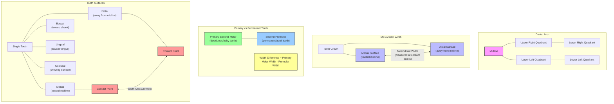
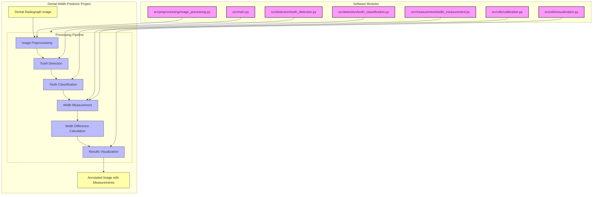

# Dental Width Predictor

A tool for measuring and predicting tooth width differences between primary second molars and second premolars in dental radiographs.

## Overview

This project automates the process of measuring the width difference between primary second molars and underlying second premolars in dental panoramic radiographs. This measurement is valuable for orthodontic treatment planning and prediction of tooth development.

## Dental Terminology

Understanding dental terminology is important for using this tool:



## Features

- Image preprocessing for dental radiographs
- Automatic detection of primary second molars and underlying second premolars
- Measurement of tooth width at the widest point (contact points)
- Calculation of width differences
- Visualization of measurements
- Batch processing for multiple images
- Interactive web dashboard for result visualization

## System Architecture



## How it works?

The project uses two TensorFlow models for the tooth detection and classification:

### Segmentation Model

A semantic segmentation model that detects and segments individual teeth in dental radiographs. This model takes the full radiograph as input and produces a segmentation mask with 3 classes:

- Class 0: Background
- Class 1: Primary Molar (deciduous/baby tooth)
- Class 2: Premolar (permanent/adult tooth)


### Classification Model

A convolutional neural network that classifies the individual tooth regions into different types (primary_molar, premolar, or other).

The models are imported from a models/model.py file which appears to be missing from the repository. 
Based on the imports and usage patterns in the code, the functions `create_segmentation_model` and `create_tooth_classifier` would define the specific architectures.
The code appears to be structured to allow fallbacks to traditional computer vision techniques if the models aren't available, suggesting this is still in development.


- Both models are trained using TensorFlow/Keras
- The segmentation model takes input images of size 512x512 pixels
- The classification model takes input images of size 128x128 pixels
- Both models use standard training practices like callbacks for early stopping, learning rate reduction, and model checkpoints


## Getting Started

### Prereq

- Install Docker Desktop

### Clone the repository

```
git clone https://github.com/ajeetraina/dental-width-predictor
cd dental-width-predictor
```

### Run the Compose Service

```
docker compose up -d --build
```

Once the service is successful run, run the following command:

```
docker exec dental-width-predictor python /app/src/batch_processing.py --input /app/data/samples --output /app/results --debug
```

wait for sometime and you will find the result:


```
Found 46 images to process.

Processing image 1/46: /app/data/samples/AVANISHK 11 YRS MALE_DR SAHEEB JAN_2013_07_22_2D_Image_Shot.jpg

Processing image 2/46: /app/data/samples/PEHAL RANKA 9 YEARS FEMALE_DR RATAN SALECHA_2015_06_25_2D_Image_Shot.jpg

Processing image 3/46: /app/data/samples/ANVI 10 YRS FEMALE_DR DHARMA R M_2014_05_01_2D_Image_Shot.jpg

Processing image 4/46: /app/data/samples/SHAMANTH 8 YRS MALE_DR UMESH CHANDRA_2017_01_18_2D_Image_Shot (2).jpg

Processing image 5/46: /app/data/samples/KANISHK 11 YERAS MALE_DR DEEPAK BOSWAN_2013_03_19_2D_Image_Shot.jpg

Processing image 6/46: /app/data/samples/SIDDHANTH 8 YEARS MALE_DR AMBIKA KRISHNA_2016_11_14_2D_Image_Shot.jpg

Processing image 7/46: /app/data/samples/DAYANITHA P 10 YEARS FEMALE_DR VENKATESH BABU_2015_01_24_2D_Image_Shot.jpg
...

Processing image 46/46: /app/data/samples/SARITHA 8 YRS FEMALE_DR ASHWIN C S_2017_01_01_2D_Image_Shot.jpg

Summary saved to /app/results/measurements_summary.csv

Processing complete!
```

For every image, it creates JSON file as shown:

```
DR KASHINATH MR_2014_01_01_2D_Image_Shot_visualization.jpg
SONIA 8 YRS FEMALE_DR MADHU C_2016_01_01_2D_Image_Shot_debug
SONIA 8 YRS FEMALE_DR MADHU C_2016_01_01_2D_Image_Shot_measurements.json
SONIA 8 YRS FEMALE_DR MADHU C_2016_01_01_2D_Image_Shot_visualization.jpg
SUPRATHI R 11 YERAS FEMALE_DR RAVINDRA S_2014_06_30_2D_Image_Shot_debug
SUPRATHI R 11 YERAS FEMALE_DR RAVINDRA S_2014_06_30_2D_Image_Shot_measurements.json
SUPRATHI R 11 YERAS FEMALE_DR RAVINDRA S_2014_06_30_2D_Image_Shot_visualization.jpg
TANVI 7 YEARS FEMALE_DR RATAN SALECHA_2016_01_01_2D_Image_Shot_debug
TANVI 7 YEARS FEMALE_DR RATAN SALECHA_2016_01_01_2D_Image_Shot_measurements.json
TANVI 7 YEARS FEMALE_DR RATAN SALECHA_2016_01_01_2D_Image_Shot_visualization.jpg
VARUN PRASAD 11 YRS MALE_DR SANJANA VSDC_2013_10_22_2D_Image_Shot_debug
VARUN PRASAD 11 YRS MALE_DR SANJANA VSDC_2013_10_22_2D_Image_Shot_measurements.json
VARUN PRASAD 11 YRS MALE_DR SANJANA VSDC_2013_10_22_2D_Image_Shot_visualization.jpg
dashboard.html
measurements_summary.csv
```

Let's verify what content does these JSON files hold:

```
cat VARUN\ PRASAD\ 11\ YRS\ MALE_DR\ SANJANA\ VSDC_2013_10_22_2D_Image_Shot_measurements.json
{
  "image": "/app/data/samples/VARUN PRASAD 11 YRS MALE_DR SANJANA VSDC_2013_10_22_2D_Image_Shot.jpg",
  "processed_date": "2025-05-01T11:36:39.925429",
  "calibration_factor": 0.1,
  "tooth_pairs": [],
  "summary": {
    "total_pairs": 0,
    "average_difference": 0
  },
  "analysis": {
    "average_ratio": 0.0,
    "std_deviation": 0.0,
    "valid_pairs": 0
  }
}
```


## Manual Installation (without Docker)

```bash
# Clone the repository
git clone https://github.com/ajeetraina/dental-width-predictor.git
cd dental-width-predictor

# Create a virtual environment (optional but recommended)
python -m venv venv
source venv/bin/activate  # On Windows, use: venv\Scripts\activate

# Install dependencies
pip install -r requirements.txt
```

## Usage

### Processing a Single Image

```bash
python src/main.py --image path/to/radiograph.jpg --output results/output.jpg
```

### Processing Multiple Images (Batch Processing)

For datasets with multiple images (20-30 images):

```bash
# Place your images in the data directory
mkdir -p data/my_radiographs
# Copy your images to data/my_radiographs/

# Run batch processing
python src/batch_processing.py --input data/my_radiographs --output results
```

This will:
1. Process each image in the directory
2. Save visualizations showing measurements
3. Save detailed measurement data as JSON files
4. Generate a CSV summary of all measurements

### Interactive Dashboard

The project includes an interactive web dashboard for visualizing results across all images:

```bash
# Process images and launch dashboard
python src/dashboard.py --input data/samples --results results

# To serve the dashboard on a specific port
python src/dashboard.py --input data/samples --results results --serve --port 8080
```

The dashboard provides:

- Summary statistics across all measurements
- Interactive visualizations (histograms, scatter plots, bar charts)
- Image gallery of all processed radiographs
- Detailed measurements for each tooth pair
- Raw data table for further analysis

#### Dashboard Features

The dashboard is organized into three main sections:

1. **Summary Statistics**:
   - Average primary molar width
   - Average premolar width
   - Average width difference
   - Standard deviation of measurements

2. **Visualizations Tab**:
   - Histogram showing distribution of width differences
   - Scatter plot of primary molar width vs. premolar width
   - Bar chart showing width differences by tooth position

3. **Image Gallery Tab**:
   - Visual results for each processed radiograph
   - Click "View Details" to see specific measurements for each image

4. **Raw Data Tab**:
   - Complete table of all measurements
   - Sortable and searchable for data analysis

## Analyzing Your Uploaded Images

To analyze the images you've uploaded to the `data/samples` directory:

```bash
# Process all uploaded images and generate dashboard
python src/dashboard.py --input data/samples --results results --serve
```

This will:
1. Process all images in data/samples
2. Generate visualizations and measurements
3. Create an interactive dashboard
4. Open the dashboard in your web browser

The dashboard will provide comprehensive analysis of all your images, including statistical summaries and visualizations of the width differences between primary second molars and second premolars.

## Dataset Management

### Using Sample Images

The repository includes a `data/samples` directory where you can find example radiographs:

```bash
# Process a sample image
python src/main.py --image data/samples/sample1.jpg
```

### Adding Your Own Dataset

You have several options for working with your dataset:

#### Option 1: Add Small Sample Images to Git

For a few representative images (recommended for public repositories):

```bash
# Copy a few small sample images (anonymized) to the samples directory
cp path/to/anonymized_sample1.jpg data/samples/

# Add to Git repository
git add data/samples/*.jpg
git commit -m "Add anonymized sample radiographs"
git push
```

#### Option 2: Use Git LFS for Larger Datasets

For larger image sets (20-30 images), consider using [Git Large File Storage (LFS)](https://git-lfs.github.com/):

```bash
# Install Git LFS
git lfs install

# Track image files with Git LFS
git lfs track "*.jpg" "*.png" "*.tiff"
git add .gitattributes

# Create dataset directory
mkdir -p data/full_dataset

# Add images to the dataset directory
cp path/to/images/*.jpg data/full_dataset/

# Commit and push
git add data/full_dataset
git commit -m "Add full radiograph dataset using Git LFS"
git push
```

#### Option 3: Local Dataset (Not in Git)

For private datasets or very large files:

```bash
# Create a directory for your dataset (not tracked by Git)
mkdir -p data/my_radiographs

# Copy your images to this directory
cp path/to/images/*.jpg data/my_radiographs/

# Ensure the directory is ignored in .gitignore (already configured)
```

## Project Structure

```
dental-width-predictor/
├── data/               # Sample radiograph images and datasets
│   ├── samples/        # Example radiographs included in the repository
│   └── my_radiographs/ # Your dataset (not tracked by Git)
├── models/             # Pre-trained models for tooth detection
├── notebooks/          # Jupyter notebooks for visualization and testing
├── results/            # Output directory for processed images and dashboard
├── src/                # Source code
│   ├── preprocessing/  # Image preprocessing modules
│   ├── detection/      # Tooth detection algorithms
│   ├── measurement/    # Width measurement tools
│   ├── utils/          # Utility functions
│   ├── batch_processing.py # Module for processing multiple images
│   ├── dashboard.py    # Interactive web dashboard
│   └── main.py         # Main entry point
├── tests/              # Unit tests
└── requirements.txt    # Dependencies
```

## How It Works

1. **Preprocessing**: Enhance the dental radiograph for better feature detection
2. **Tooth Detection**: Identify and segment individual teeth in the image
3. **Tooth Classification**: Classify and locate primary second molars and second premolars
4. **Width Measurement**: Measure the width at the widest points (contact points)
5. **Difference Calculation**: Calculate the width difference between corresponding teeth
6. **Visualization**: Display results with overlays showing measurements
7. **Dashboard**: Aggregate results across all images for comprehensive analysis

## License

MIT

## Contributing

Contributions are welcome! Please feel free to submit a Pull Request.
